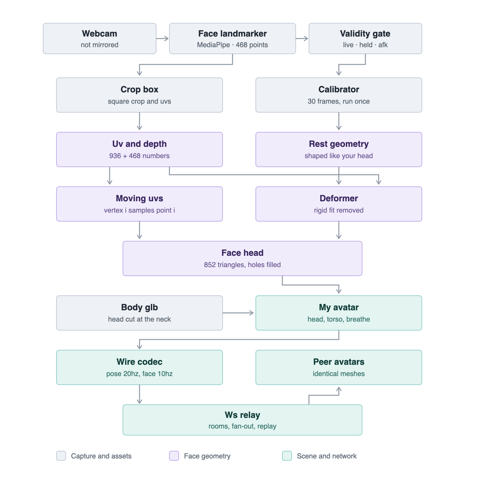

# FaceHangout

A multiplayer 3D space where your live webcam face is mapped onto a 3D head
shaped from your own facial geometry.

```bash
npm install
npm run dev
```

Then open http://localhost:5173. Add `?room=name` to use a room other than the
lobby; open a second tab in the same room to see multiplayer.

**Controls** — `WASD` move · hold **right-click** and drag to orbit · scroll to
zoom · `C` recalibrate

---

## How it works



*One camera frame, from the webcam to a peer's screen.*

### Moving UVs, plus expression-only geometry

Two things drive the head each frame, and the split between them is the core of
the design.

**Texture coordinates** track the landmarks: every frame the 468 landmark
positions are written into the `uv` attribute and the video crop is blitted into
the head's texture.

**Vertex positions** carry expression — but only expression. Feeding live
landmarks straight into the geometry would rotate the head with your real one,
which is not wanted: the avatar's head follows its *body*. So each frame a rigid
transform is fitted from the live landmarks onto the calibrated rest pose and
then *removed*. What survives is jaw drop, lip motion and brow movement; head
rotation is cancelled by construction.

Getting this wrong is subtle rather than obvious. With UVs alone the face is an
anatomically **rigid mask**: vertex *i* always samples landmark *i*, so your
upper lip is glued to the upper-lip vertex forever. Open your mouth and the
pixels move, the UVs move with them, and the same anatomy renders in the same
place — the mouth appears shut. The visible expression is only shading and
wrinkle texture. Removing lip geometry doesn't fix that, because the pin is in
the UV mapping, not the surface.

Two details make the deformation usable:

- **The silhouette is pinned.** The cranium is welded to the rest-pose oval
  loop, so a moving rim tears the head open along the jaw. Deformation is
  smoothstepped to zero within `0.12 × HEAD_HEIGHT` of the loop. Lips, brows and
  nostrils sit well inside that and still move fully.
- **The fit uses rigid landmarks only** — nose bridge, eye corners, brow ridge,
  temples. Including the jaw or lips would let expression drag the alignment, so
  an open mouth would partly read as a change of head pose and cancel itself out.

Rotation comes from Horn's quaternion method: the optimal rotation is the
dominant eigenvector of a 4×4 matrix built from the cross-covariance. Rather
than pull in an SVD, it power-iterates, warm-started from the previous frame's
quaternion — an excellent guess, because heads move slowly. It recovers a known
rotation to 0.00° and scale to four decimals.

The triangle topology comes from `FACE_LANDMARKS_TESSELATION`. The package only
exposes it as an *edge* list for wireframe drawing, but it's generated from the
underlying triangle list and preserves its order: every consecutive run of three
edges is one closed triangle. Verified across all 2556 edges — 852 triangles, no
exceptions. See `src/face/landmarker.ts`.

### The mouth and eyes are holes, closed with video

`FACE_LANDMARKS_TESSELATION` is not a closed sheet. Counting how many triangles
use each edge finds exactly four boundary loops: the face oval, both eyelid
contours, and the inner lip contour. Nothing spans the lips at all — so opening
your jaw used to reveal the inside of the cranium, and the eye sockets showed
the same dark shell.

No amount of landmark work fixes this, because MediaPipe does not track teeth,
tongue or eyeball. It doesn't have to. The texture is live video and the UVs
*are* the landmark positions, so the real mouth interior is already in the
texture, in the region bounded by the inner lip UVs. `src/face/holes.ts` fans
each hole shut and samples that same texture, which paints teeth and tongue
back on for no extra bytes and no wire change — a peer's mouth is rebuilt from
numbers it already receives.

The mouth's fan apex is then pushed backward in proportion to the lip gap, so it
reads as a cavity rather than a decal across the teeth, and darkened toward the
apex as a cheap ambient occlusion. That depth is invented rather than measured;
it is the part of the hybrid that only has to convince the eye. A closed mouth
has zero gap, so the fan collapses to a sliver and disappears on its own. The
eyes get the same membrane with zero depth, since an eyeball sits at the
surface.

`test/holes.test.ts` re-derives the boundary loops from the tesselation and
requires the hard-coded rings to match them exactly, so if a future MediaPipe
triangulates the mouth shut the test says so rather than the app quietly
drawing a membrane over real geometry.

### The head is shaped like your head

Rather than shipping MediaPipe's canonical face model, a short calibration
averages ~30 frames of your own landmarks and freezes that as the rest geometry.
No external asset, and the head actually resembles you.

Calibration uses a stricter quality gate than normal operation, because the rest
geometry is captured once and everything downstream inherits its mistakes.

### The back of the head is grown from the face's own silhouette

The face mesh is an open shell, so it needs a back — otherwise you see the
inside of a hollow mask from behind.

The obvious fix, a sphere placed behind the face, fails badly. A sphere large
enough to read as a skull reaches *further forward* than the cheeks, forehead
and jaw do, so it swallows the face and leaves only the nose, brow ridge and
lips protruding. It looks like a dark mask with a stripe of skin. A plain
hemisphere has exactly the same failure mode.

Instead `src/face/cranium.ts` extracts the 36-vertex face-oval loop and grows a
dome backward from it. Because it starts precisely where the face ends and only
ever travels backward, it *cannot* occlude any face vertex, whatever shape the
calibration produced.

`test/cranium.test.ts` asserts this by raycasting every one of the 468 face
vertices against the cranium and requiring zero to be buried — then re-runs the
same check against the old sphere and requires it to fail, so the test can't
quietly become vacuous.

The dome's winding is auto-corrected rather than assumed: the loop's direction
isn't documented, so the code builds the geometry, checks whether the pole
normal points backward, and reverses every triangle if it doesn't.

Its colour is sampled from the middle of the live face crop once a second, so
the back of the head matches the wearer instead of being a flat grey shell.

### The body is a GLB with its head cut off

`public/models/body.glb` is a single un-skinned mesh, so there is no node to
hide and the character's own head cannot simply be switched off — and leaving it
in would mean it poking out around the face, since the calibrated head is
*narrower* than the model's. `src/body.ts` therefore bakes the GLB's node chain
into the geometry and deletes every triangle above the neck.

The neck is found rather than hard-coded. The model is a surface of revolution,
so its profile is a list of rings, and the neck is the first pinch above the
widest ring — *first*, not narrowest, because the narrowest ring above the torso
is the crown, a single vertex of radius zero, and cutting there removes nothing.
Ring detection sweeps vertices by height rather than bucketing them by a rounded
key: hard shading edges duplicate a ring at heights that differ only in the last
bits of a float, and splitting those two copies apart makes their radii differ
by noise — enough to stop the search dead at the shoulders. Both mistakes were
made, and `test/body.test.ts` catches both.

The cut leaves an opening, which the neck cylinder plugs. Its flared end has to
sit *at* the cut rather than below it: a cone wide enough at its base is already
too narrow by the time it rises to the shoulder line, leaving a crescent of the
body's hollow interior on show from any raised camera angle.

The shipped idle is 31 linear keys animating one node's scale, and it is exactly
`0.95 + 0.05·cos(2πt)` — checked key by key against the asset. Reproducing it in
closed form drops the AnimationMixer entirely and, more usefully, makes the
scale available as a number: the body breathes about its feet, so the shoulder
line drops by `shoulderY·(1−s)`, and the head has to drop with it or it floats
off the neck. The head does *not* scale with the body — a face that rhythmically
changes size reads as a bug rather than as breathing.

### The body is sized from the chin, not from a constant

Rest geometry is centred on the landmark centroid — a point *on the face* — so
the face sits near z=0 and the entire cranium hangs behind it. Parenting that
straight to the body puts the spine level with the cheeks: the head reads as set
back, and the chin ends up directly above the shoulders with nowhere to go. The
head is therefore re-centred on its own front-to-back extent, face shell plus
cranium, which leaves the face overhanging the chest the way a real one does.

The body is then scaled so its *neck* lands on the shoulder line derived from
the calibrated chin, leaving a constant `JAW_CLEARANCE` gap — the character's
proportions are preserved, its overall height is not.

The jaw is the one part of the face that deforms *downward*, so any shoulder
reaching the resting chin gets a chin driven through it the moment the mouth
opens — and how far down the chin starts depends on whose face was calibrated.

### Coordinate conventions

The camera image is **not** mirrored, so image-x maps straight to world-x: a
point on your right sits at low image-x, which is exactly where a viewer facing
you expects to see it. Image y grows downward and MediaPipe z grows away from
the camera, so both are negated. `test/face.test.ts` pins all three.

### LIVE / HELD / AFK

| State | Trigger | Texture | Network | Appearance |
|---|---|---|---|---|
| `LIVE` | valid face | updating | face at 10Hz | normal |
| `HELD` | ~5 bad frames | **frozen** | face paused | identical to LIVE |
| `AFK` | 30s continuous HELD | frozen | idle | dimmed + badge |

Glancing away should not broadcast that you glanced away, so `HELD` is
deliberately indistinguishable from `LIVE` to everyone else. Only a sustained
30-second absence surfaces as AFK.

Two details that matter:

- **The gate is not `landmarks.length > 0`.** On a profile view MediaPipe returns
  a confident but badly wrong face rather than returning nothing. So validity
  also checks apparent size and left/right symmetry, the latter doubling as a
  cheap yaw proxy that needs no pose matrix.
- **Every edge has hysteresis.** Without the frame counters the head strobes
  between live and frozen whenever you sit near the quality threshold. Returning
  from AFK additionally needs ~15 sustained good frames, so blinking into frame
  every 29 seconds can't dodge the timer.

### Camera and body facing are decoupled

Roblox-style. Right-drag orbits the camera anywhere, including round to the
front; the body does not follow it. Movement is expressed in the camera's frame
(W is "away from the camera") and the body then turns toward whichever way it is
actually travelling.

Pinning body yaw to camera yaw — the obvious first implementation — means the
avatar spins away from the camera exactly as fast as you orbit, so your own face
is permanently unreachable. `test/controls.test.ts` pins both the decoupling and
the handedness of the movement basis, the latter because getting the sign of
`right` wrong silently swaps A and D and it shipped that way once.

### Networking

A dumb WebSocket relay (`server/index.ts`, port 8787, proxied at `/ws`). Three
binary message types; the server stamps the sender id it assigned rather than
trusting a client-supplied one, and caches each peer's identity, last pose and
last face so late joiners aren't left staring at untextured heads.

| Message | Rate | Size |
|---|---|---|
| `POSE` | 20Hz | 20 B |
| `FACE` | 10Hz, LIVE only | ~7.8 KB (1.9 KB UVs + 0.9 KB depths + JPEG) |
| `IDENTITY` | once per join | 5.6 KB |

That's **~76 KB/s (~610 kbps) up** per participant. A six-person room pulls
roughly 3 Mbps down. The 2.8 KB of UVs and depths is a fixed floor at 16-bit
precision, so shrinking the JPEG alone has limited returns — delta-encoding them
is the next real win if rooms need to get bigger, followed by moving to WebRTC.

Peers reconstruct expression rather than receiving it. The UVs *are* the
landmark x/y, so only depth needs adding — 936 bytes, versus thousands for
shipping vertex positions. Both ends then run identical code over identical
input, so a peer's mesh matches what its owner is rendering.

UVs, depths and the JPEG travel in a single message, so a frame can never be
textured with stale UVs or deformed by mismatched depths.

### Bounding box smoothing is cosmetic, not load-bearing

The crop box is EMA-smoothed, but UVs are computed against *the same box* used
for the crop, so any jitter cancels and the face stays locked to the geometry
regardless. The smoothing only stops the resampling from shimmering.

---

## Tests

```bash
npm test
```

Covers the wire codec against the real modules (round-trips, the unaligned-offset
trap, UV quantisation, bandwidth); the face math (calibration scale, all three
coordinate conventions, the validity gate, every state-machine edge including the
30-second AFK boundary); the camera/movement basis, asserted by projecting
world movement into the camera's own view space so that "D goes screen-right"
is checked literally rather than by eyeballing signs; the cranium's
non-occlusion; the mouth and eye rings, re-derived from the tesselation's own
boundaries; the body GLB, whose neck cut and idle curve are checked against the
shipped asset rather than a fixture; and the deformer — that a purely rotated head renders at exactly
the rest pose, that an open mouth still opens once the head is also turned, that
the rim stays pinned, and that sender and receiver derive identical meshes.

The relay needs a running server:

```bash
npm run test:relay
```

Covers fan-out, absence of self-echo, id stamping, late-joiner replay and leave
notification.

### Not covered

The live webcam path — camera → landmarks → crop → texture — has no automated
coverage, because it needs a real camera pointed at a real face. Everything
feeding it and everything downstream of it is tested; the seam itself is verified
by eye.
